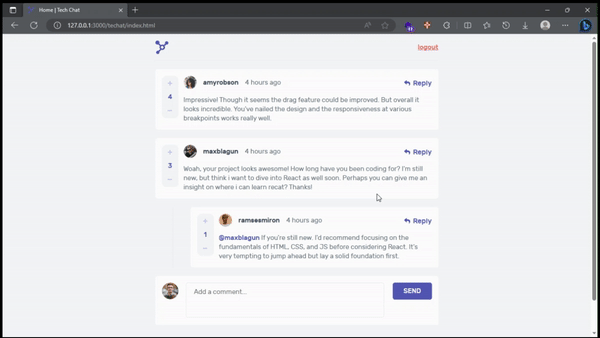

# Techat

Techat is an discussion forum web application centered on web technology stuffs.
The web application includes these features:

- Account creation
- Messages management (add, edit, delete, reply, score)
- Login and logout features

Built with:

- [Html](https://en.wikipedia.org/wiki/HTML)
- [Css](https://en.wikipedia.org/wiki/CSS)
- [Javascript](https://en.wikipedia.org/wiki/JavaScript)
- [Techat API](https://github.com/segnbi/api.techat.git)